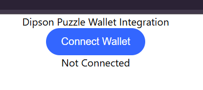
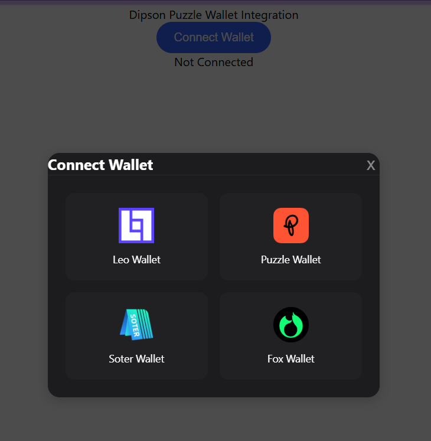
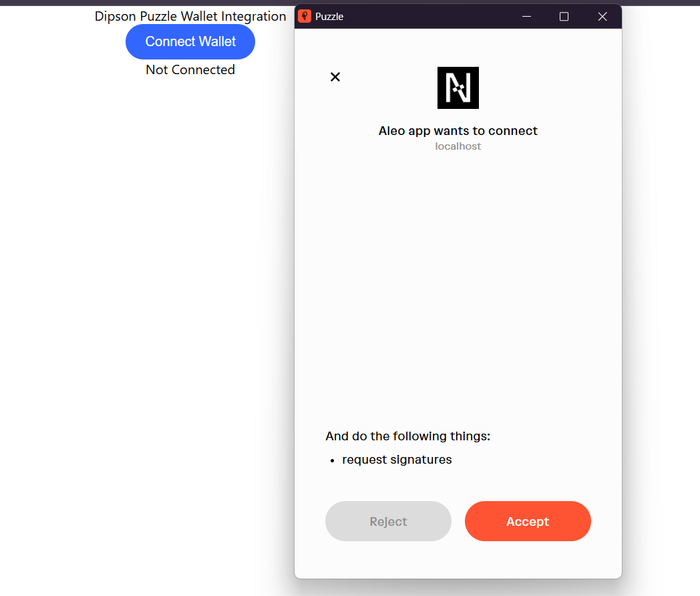
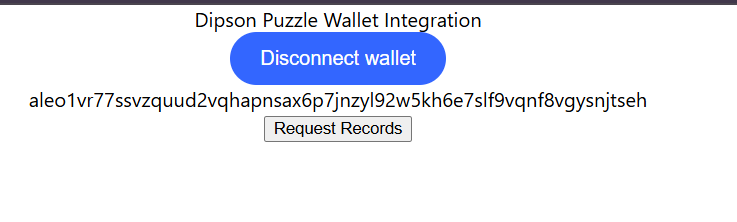

# Puzzle Wallet Integration
## Create project:
```sh
npx create-react-app dipson_puzzle_wallet_integration
```

## Start Project:
- Command:
    ```sh
    npm run start
    ```
- Visit [http://localhost:3000](http://localhost:3000). If started without errors, we can see like below:

    

- Click on `Conect Wallet`. And Select Puzzle Wallet:

    

- Then, Authorization Pop up will open up. Click in `Accept`:

    

- Once accepted, we can see our Address in our App:
    
    

- We can slimply click on `Disconnect Wallet` to unlick from Puzzle Wallet.