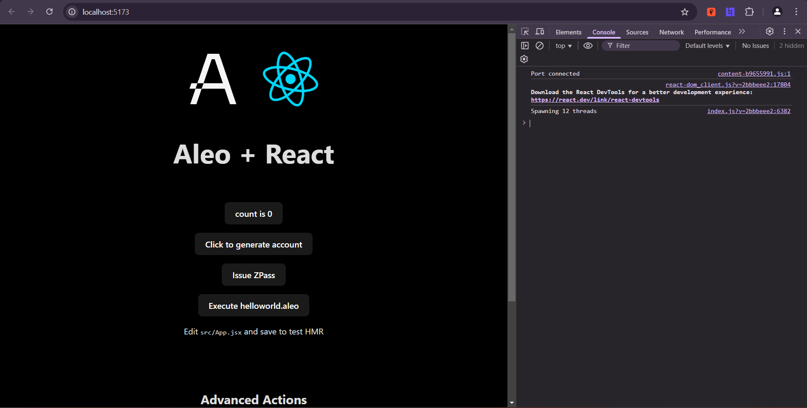
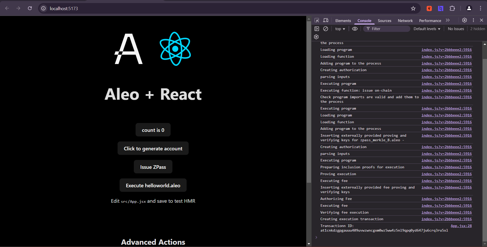

# ZPass Integration

## Create React Leo App:
- Command:
    ```sh
    npm create leo-app@latest
    ```
    
    <details><summary> Detailed Output </summary><blockquote>

    ~~~sh
    > npx
    > create-leo-app

    ✔ Project name: … dipson-leo-zpass-integration
    ✔ Select a framework: › React
    ✔ Select a variant: › JavaScript + Leo

    Done. Now run:

    cd dipson-leo-zpass-integration
    npm install
    npm run dev
    ~~~

    </blockquote></details>

- Install Dependencies:
    ```sh
    npm i zpass-sdk vite-plugin-wasm
    ```

## Start Project:
- Command:
    ```sh
    npm run dev
    ```
- Then, visit [http://localhost:5173](http://localhost:5173).

    

- Click in `Issue ZPass` Button:
    


- Transaction ID: `at1cnkdzgpgauuu409uvwzwncgxm0wz5ww4z5nl9qpq0yd647ju6crq3ru5xl`

# Signature:
## Sign with `Transaction ID`:
- For me, program deployed Transaction ID is: `at1cnkdzgpgauuu409uvwzwncgxm0wz5ww4z5nl9qpq0yd647ju6crq3ru5xl`. Command:
    ```sh
    leo account sign -d --private-key <redacted> --message "at1cnkdzgpgauuu409uvwzwncgxm0wz5ww4z5nl9qpq0yd647ju6crq3ru5xl" --raw
    ```
- Output:
    ```sh
    sign1s0sgfdn4kp7eutmn08n97edezgmevkggn75k9gr9342t83vk4qpsx4mtfv8wptg5uqea74hpjm333zldknjutsm9adhep8e4f77gzp9z3ku2r6nfe0g0pf6e6tlvc53xrktfmtksdtq6l0q0c4kqtjnhq80h804g6x09zfctv4fk7ux2888jsmr59htqps7p3cg9amq5utaq6ucmvhn
    ```