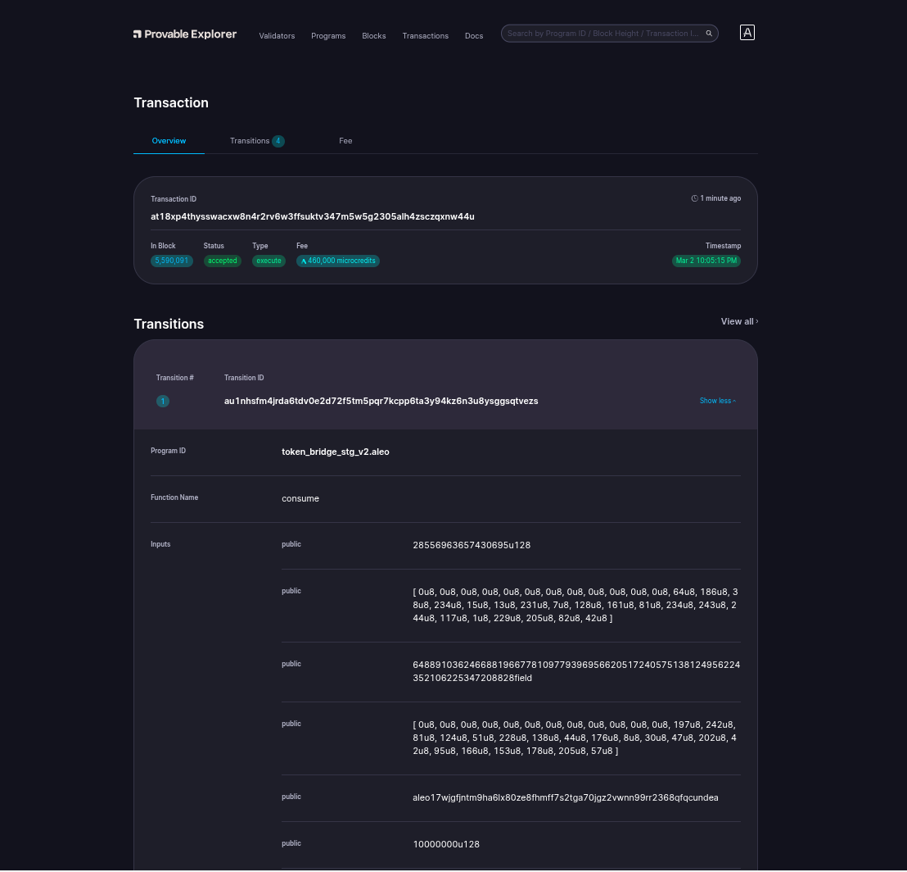

# Bridging On Aleo

- Transaction ID: `at18xp4thysswacxw8n4r2rv6w3ffsuktv347m5w5g2305alh4zsczqxnw44u`.
  
    

- Here, I transferred 20USDC from ETH Sepolia Network to ALEO Test Network.

# Signature:

## Sign with `Transaction ID`:
- For me, program deployed Transaction ID is: `at18xp4thysswacxw8n4r2rv6w3ffsuktv347m5w5g2305alh4zsczqxnw44u`. Command:
    ```sh
    leo account sign -d --private-key <redacted> --message "at18xp4thysswacxw8n4r2rv6w3ffsuktv347m5w5g2305alh4zsczqxnw44u" --raw
    ```
- Output:
    ```sh
    sign1hxac0h6q236gs57rr2qndgszz69jm6gtfnw66zswp54nkkucnupt6g779vv76j6u4aflnv2ffj0ujllepgeyy67tdfdydvvyt4mfuqru23rr6mhkgkrusjsmmc7taewueergms2yf25r2fxqy9fphr4aqrj4uvr5pmmj9hcjx0g5kvp3mxavfe7fq5ppdgjnkpyg65u0acrscmaxn5f
    ```